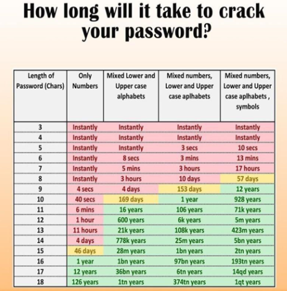

### 📝 Analiza in poročilo

- Zabeležite, katera gesla so bila najdena in kako hitro. Program je potreboval zelo malo časa, da našel gesla.

```bash
john --format=raw-md5 --wordlist=rockyou.txt hashes.txt
Using default input encoding: UTF-8
Loaded 6 password hashes with no different salts (Raw-MD5 [MD5 128/128 AVX 4x3])
Remaining 3 password hashes with no different salts
Warning: no OpenMP support for this hash type, consider --fork=4
Press 'q' or Ctrl-C to abort, almost any other key for status
0g 0:00:00:00 DONE (2025-12-03 11:45) 0g/s 16678Kp/s 16678Kc/s 50034KC/s  filimani..*7¡Vamos!
Session completed.

john --show --format=raw-md5 hashes.txt
user1:Password1
user2:qwerty123
user4:letmein
```


- Katerega močnega gesla program ni našel? Zakaj? Našel ni 3., 5. in 6. gesla, ker teh ujemanj ni v datoteki `rockyou.txt`.  Sicer bi morali več ročnih hashov naračunati in posledično bi našli še manjkajoče.

## 3️⃣ Refleksija in analiza

- Kako se povečuje ocena varnosti, ko dodajate dolžino?

Lahko si pomagamo s sliko, iz katere lahko vidimo razmerje, koliko znakov in kombinacij velikih in malih črk, številk in posebnih simbolov, vplivajo na razbitje gesel.

- Kako vplivajo posebni znaki na oceno? Definitivno pomagajo pri varnosti, vendar mora biti geslo kompleksno npr. ne sme v tem primeru uporabljati samo posebne znake, ampak zelo priporočljiva je mešanica nabora (velike in male črke, števke in posebni znaki).
- Kako se ocenjuje “passphrase” v primerjavi s klasičnim geslom?
- Katero geslo bi priporočili za vsakodnevno uporabo in zakaj? Odvisno od konteksta uporabe aplikacije. Načeloma, če si pomagamo z zgornjo sliko, bi rekel da vzamemo geslo sestavljeno iz 10 znakov, ki vsebujejo velike in male črke, števke in simbole.

