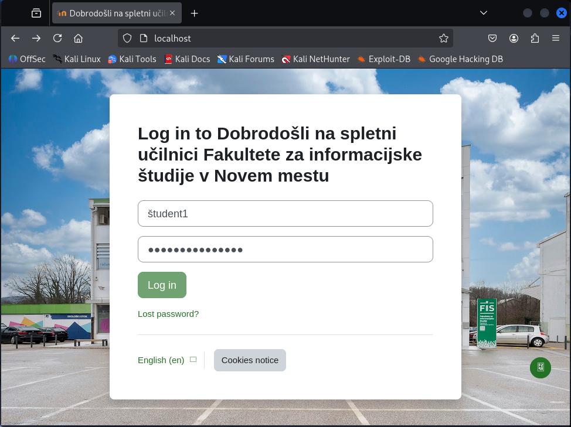
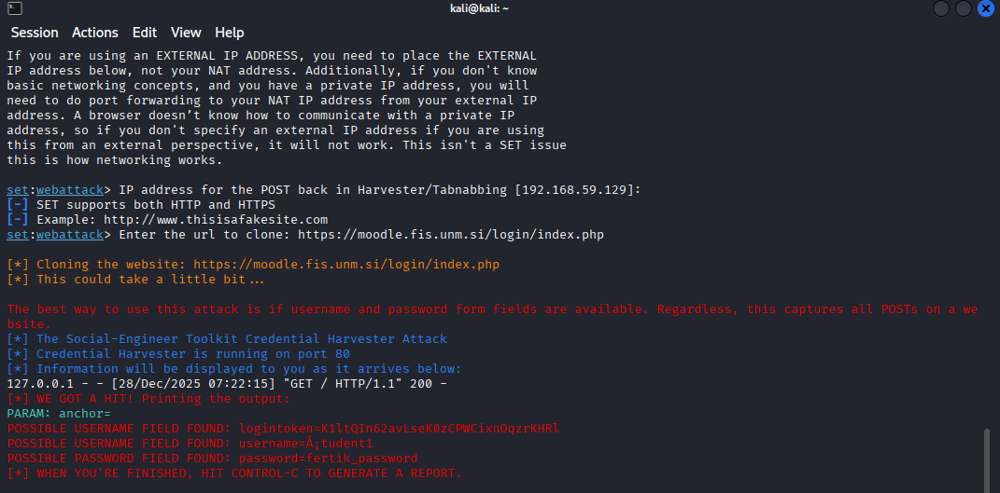

### 📝 Analiza in poročilo

Oddajte poročilo z naslednjimi vsebinami:
- Posnetek zaslona lažne prijavne strani

- Posnetek zaslona terminala s zajetimi podatki

- Kratek opis, kako bi žrtev prepoznala, da gre za phishing stran
Menim, da zelo težko. Naj enostavneje je, da se pogleda url naslov, v kolikor zgleda sumljiv npr. uporaba napačne domene (npr. moodle.fis.faks4.superneki12.in), http namesto https, če pa že uporablja https se lahko še preveri certifikat.

3️⃣ Refleksija in analiza

- Katere značilnosti so značilne za phishing strani (npr. napačen URL)? Ko izpolnimo obrazec ne dobimo povratne informacije o tem, ali je bila prijava uspešna, ostale na strani so sumljive. Nekatere kontrole na strani ne delujejo pravilno.

- Kako bi se zaščitili pred takšnim napadom? Vedno preveri url naslov, uporabljaj password manager (ponavadi ti sam izpolni obrazec - v kolikor je stran fake, ti ga ne bi, torej bi to lahko pomenili da ni varno), ne klikamo sumljivih povezav.

- Zakaj moderne strani otežujejo takšne napade? Uporabljajo enkratne tokene, CSRF zaščito, moderne strani uporabljajo javascript preverjanje - preverja se domena / izvor, se lahko prijava tudi blokira.