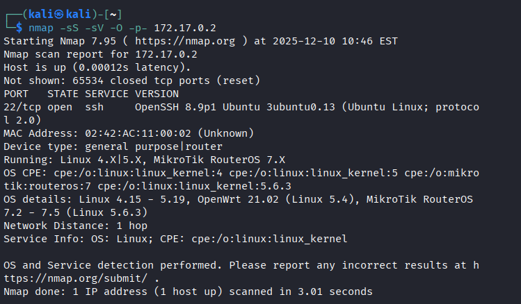
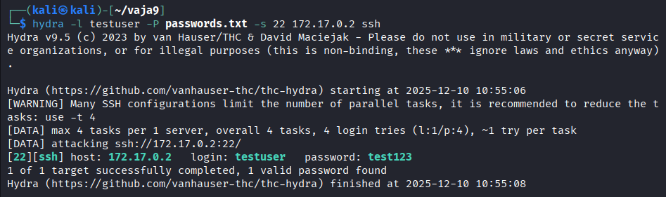

## 3️⃣ Analiza in poročilo

Oddajte poročilo z naslednjimi vsebinami:
- Izpis rezultatov `nmap` (katere storitve/vrata so odprta)

```bash
└─$ nmap -sS -sV -O -p- 172.17.0.2
Starting Nmap 7.95 ( https://nmap.org ) at 2025-12-10 10:46 EST
Nmap scan report for 172.17.0.2
Host is up (0.00012s latency).
Not shown: 65534 closed tcp ports (reset)
PORT   STATE SERVICE VERSION
22/tcp open  ssh     OpenSSH 8.9p1 Ubuntu 3ubuntu0.13 (Ubuntu Linux; protocol 2.0)
MAC Address: 02:42:AC:11:00:02 (Unknown)
Device type: general purpose|router
Running: Linux 4.X|5.X, MikroTik RouterOS 7.X
OS CPE: cpe:/o:linux:linux_kernel:4 cpe:/o:linux:linux_kernel:5 cpe:/o:mikrotik:routeros:7 cpe:/o:linux:linux_kernel:5.6.3
OS details: Linux 4.15 - 5.19, OpenWrt 21.02 (Linux 5.4), MikroTik RouterOS 7.2 - 7.5 (Linux 5.6.3)
Network Distance: 1 hop
Service Info: OS: Linux; CPE: cpe:/o:linux:linux_kernel

OS and Service detection performed. Please report any incorrect results at https://nmap.org/submit/ .
Nmap done: 1 IP address (1 host up) scanned in 3.01 seconds
```

Odprta je storitev SSH na vratih 22.



- Izpis rezultatov `hydra` (ali je geslo najdeno)

Geslo je bilo najdeno:

```bash
└─$ hydra -l testuser -P passwords.txt -s 22 172.17.0.2 ssh 
Hydra v9.5 (c) 2023 by van Hauser/THC & David Maciejak - Please do not use in military or secret service organizations, or for illegal purposes (this is non-binding, these *** ignore laws and ethics anyway).

Hydra (https://github.com/vanhauser-thc/thc-hydra) starting at 2025-12-10 10:55:06
[WARNING] Many SSH configurations limit the number of parallel tasks, it is recommended to reduce the tasks: use -t 4
[DATA] max 4 tasks per 1 server, overall 4 tasks, 4 login tries (l:1/p:4), ~1 try per task
[DATA] attacking ssh://172.17.0.2:22/
[22][ssh] host: 172.17.0.2   login: testuser   password: test123
1 of 1 target successfully completed, 1 valid password found
Hydra (https://github.com/vanhauser-thc/thc-hydra) finished at 2025-12-10 10:55:08
```



- Kratek komentar: zakaj je uporaba šibkih gesel nevarna in zakaj zapirati neuporabljene porte

Z uporabo programa `hydra` lahko po principu brute force lahko vstavljamo in testiramo možna gesla, ki jih imamo v datoteki, kar to lahko storimo zelo hitro. 
Če ne zapiramo ne uporabljene porte jih s programom `nmap` lahko skeniramo.  S tem je napadalec bolj informiran o tarči, lahko ve kateri os teče, katere so storitve ipd. Na podlagi tega, lahko temu primeren napad izvede. 

---

## 4️⃣ Refleksija in analiza

- Kako bi zaščitili SSH strežnik pred brute-force napadi? Zamenjali bi port (npr. iz 22 na 29807), dodali bi omejitve na prijavo, dodali **MFA** (angl. Multifactor authentication) login.
- Katere dodatne ukrepe (npr. omejitve po številu prijav, uporaba javno-zasebnih ključev, firewall) bi priporočili? Prestavil bi port 22 na kaj drugega npr. 29807. Onemogočili bi root uporabnika, in bi dali nekemu drugemu uporabniku admin pravice. Password-less login, login je mogoč le s ključem brez gesla. Onemogočili bi ostale porte, ki jih ne uporabljamo.
- Kako se spremeni rezultat, če uporabimo zelo močno geslo? Če je cilj samo ugotoviti na katerem portu teče servis SSH, potem nam močno geslo nič ne pomaga. V kolikor bi želeli še dostop do računalnika potrebujemo geslo, ker je močno ga bo napadalec zelo težko ugotovil oz. če se skličem odgovor iz [vaje 6](../lab06/RESITEV_06.md), v kolikor geslo izpolnjuje vsaj 10 znakov, velike, male črke, števke in simbole bo rabil cca 982 let.

