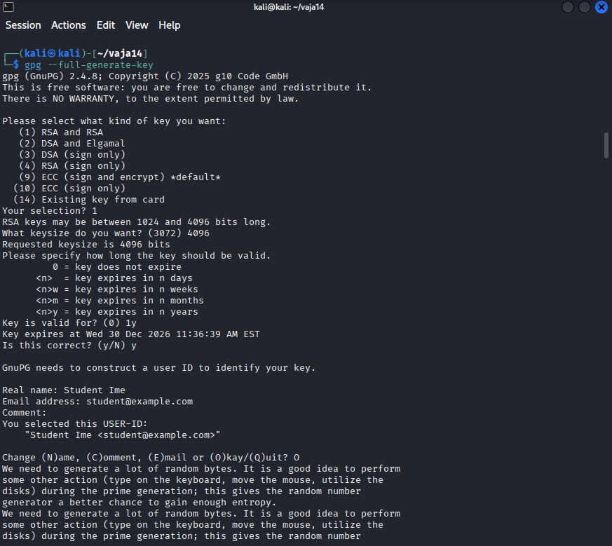
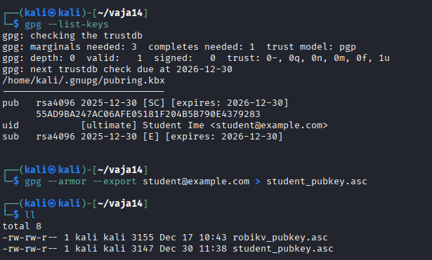
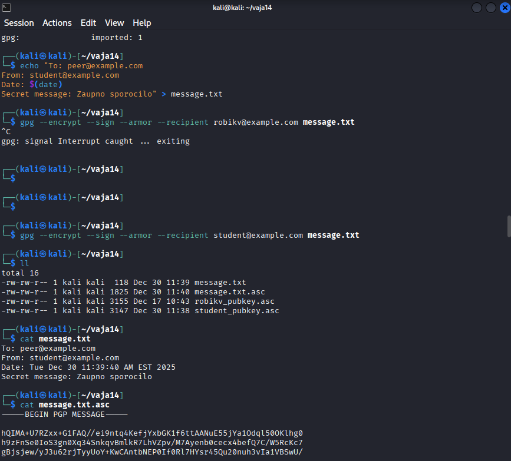
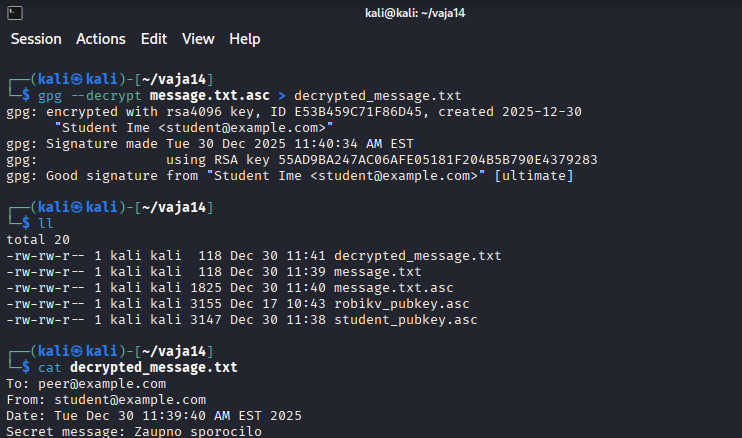

# Vaje 14
V poročilo vključite:
- uporabljene ukaze,
- posnetek zaslona terminala,

```bash
gpg --full-generate-key
gpg --list-keys
gpg --armor --export student@example.com > student_pubkey.asc
ll
cat student_pubkey.asc
echo "To: peer@example.com\nFrom: student@example.com\nDate: $(date)\nSecret message: Zaupno sporocilo"
gpg --encrypt --sign --armor --recipient student@example.com message.txt
ll
cat message.txt
cat message.txt.asc
gpg --decrypt message.txt.asc > decrypted_message.txt
ll
cat decrypted_message.txt
```
 












---
Kratki odgovori:
  1. Razlika med šifriranjem in podpisom. Šifriranje poskrbi za spremembo zapisa v ne berljivi obliki. Podpis se uporabi za preverjanje, ali je bilo sporočilo med prenosom spremenjeno. 
  2. Vloga javnega in zasebnega ključa. Javni ključ je namenjen šifriranju sporočila prejemnika. Potem prejemnik s svojim zasebnim ključem dešifrira prejeto sporočilo. Zasebnega ključa ne delimo. 
  3. Kaj se zgodi ob spremembi šifrirane datoteke? Dobimo CRC napako, ker izvleček sporočila ne ujema s podpisom. 